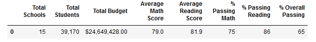
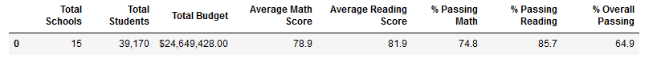
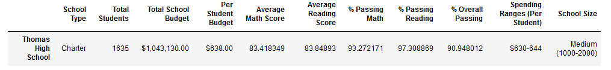
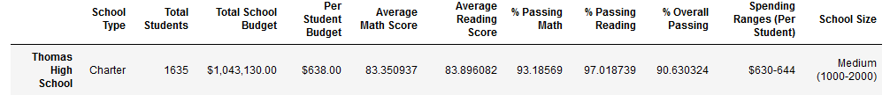

# School_District_Analysis

## Overview of the School District Analysis – Supplemental Request
#### Original Request
A city school district asked us to prepare an analysis of the performance of high schools in the district. This analysis was to be performed in conformance with the Family Educational Rights and Privacy Act (FERPA) of the U.S. Department of Education. This analysis was prepared and submitted to the school district. 
#### Supplemental Request
Subsequently, the school district reported the discovery of an anomaly in grade reports of one of the grade levels at a single high school and were worried that this anomaly might have skewed the analysis. The district requested that the analysis previously provided be recalculated without the suspect grades. 
## Results 
- **District Summary:** The recalculated district summary indicated differences amounting to a few tenths of one percent for some results. The average math score dropped by 0.1 from 79.0 to 78.9 while the average reading score remained the same at 81.9.  For the percentage calculations, there was a change in the number of significant figures used in the calculation between the original analysis and the refactored analysis, specifically the original analysis calculated percentages rounding to the nearest whole number and the refactored analysis recalculated them with one significant figure behind the decimal place, to the nearest tenth of a percent. This caused the percent passing math to appear to have dropped 0.2% from 75% to 74.8%, the percent passing reading to appear to have dropped 0.3% from 86% to 85.7%, and the percent passing overall to appear to have dropped 0.1% from 65% to 64.9%.  However, if the refactored calculation had been rounded to the nearest whole number like the original analysis, the percentage values would have been the same. 
- Image of the original district summary: 
  - 
- Image of the refactored district summary:
  - 
- **School Summary:** As might have been expected, the performance of all schools was identical in both analyses except for Thomas High School. Even the school rankings did not change.

- **Thomas High School’s performance relative to the other schools:** The refactored calculations affected the scores of Thomas High School only slightly. In fact, if rounded to whole numbers, all the percentage scores for Thomas High School would have come out the same. As alluded to previously, the change in scores did not affect Thomas High School’s ranking.

- Image of the original Thomas High School scores: 
  - 
- Image of the refactored Thomas High School scores:
  - 

- **Impact of refactored calculations:**
- The refactoring amounted to removing any contribution of Thomas High School’s ninth grade grades data from the analysis. This appeared to have no impact on the following outcomes:
  - **Math and reading scores by grade:** There were no changes in the math and reading score mean values for any grade of any high school except that the ninth grade mean value score for Thomas High School was not reported.  
  - **Scores by school spending:** There were no differences in the scores for per student spending ranges (<$584, $585-629, $630-644, and $645-675).
  - **Scores by school size:** There were no differences in the scores for the different school sizes [Small (<1000), Medium (1000-2000), and Large (2000-5000)].
  - **Scores by school type:** There were no differences in the scores for the two school types (Charter and District)

## Summary

In summary, very little changed in the refactored analysis. 
- The average math score for the district dropped by 0.1%
- Thomas High School’s math and reading scores decreased slightly, but not enough to cause even a 1% change in their values.
- The mean scores for every grade of every high school came out the same (except that Thomas High School’s ninth grade mean was not reported in the refactored analysis)
- All other measurements (Scores by school spending, Scores by school size, and Scores by school type) came out the same.
